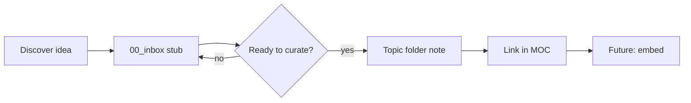

# Vault Model

How kb is organized, how notes flow, and how the vault prepares for RAG ingestion.

---

## Layers

```text
Capture     00_inbox/
Curate      01_concepts/ … 05_references/
Navigate    06_maps/
Scaffold    99_templates/
Govern      docs/ + Grok_*.md
```

---

## Note lifecycle



1. **Capture** — fast stub in inbox with `status: inbox`
2. **Curate** — promote to topic folder with full template
3. **Connect** — wikilinks + MOC entry
4. **Ingest** (future) — export markdown → chunk → embed

---

## MOC rules

Maps of content live in `06_maps/`. A MOC is an index, not a duplicate of child notes.

- Use bullet lists of wikilinks grouped by theme
- One sentence per link optional
- Do not paste full note bodies into MOCs

Starter MOCs:

- `06_maps/rag-moc.md`
- `06_maps/software-engineering-moc.md`
- `06_maps/kb-home.md`

---

## Ingestion scope (future)

**Include:**

- `01_concepts/` through `05_references/`
- `06_maps/` (lower priority; smaller chunks)

**Exclude:**

- `00_inbox/` (unprocessed)
- `99_templates/` (scaffolds)
- `Grok_*.md`, `BOOTSTRAP.md` (agent ops, not knowledge)

---

## Obsidian integration

- Vault root: `D:\Workarea\kb`
- Attachments: `attachments/` when needed
- Git-ignore volatile Obsidian workspace files (see `.gitignore`)

No required community plugins. Dataview or Templater may be added later.