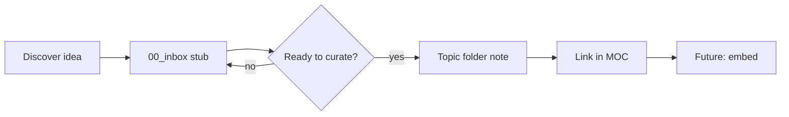

# Vault Model

How kb is organized, how notes flow, and how the vault prepares for RAG ingestion.

---

## Layers

```text
Capture     00_inbox/
Curate      01_concepts/ … 05_references/
Navigate    06_maps/
Scaffold    99_templates/
Govern      docs/ + Grok_*.md
```

---

## Note lifecycle



1. **Capture** — fast stub in inbox with `status: inbox`
2. **Curate** — promote to topic folder with full template
3. **Connect** — wikilinks + MOC entry
4. **Ingest** (future) — export markdown → chunk → embed

---

## MOC rules

Maps of content live in `06_maps/`. A MOC is an index, not a duplicate of child notes.

- Use bullet lists of wikilinks grouped by theme
- One sentence per link optional
- Do not paste full note bodies into MOCs

Starter MOCs:

- `06_maps/rag-moc.md`
- `06_maps/software-engineering-moc.md`
- `06_maps/kb-home.md`

---

## Ingestion scope (future)

**Include:**

- `01_concepts/` through `05_references/`
- `06_maps/` (lower priority; smaller chunks)

**Exclude:**

- `00_inbox/` (unprocessed)
- `99_templates/` (scaffolds)
- `Grok_*.md`, `BOOTSTRAP.md` (agent ops, not knowledge)

---

## Obsidian integration

- Vault root: `D:\Workarea\kb`
- Attachments: `attachments/` when needed
- Git-ignore volatile Obsidian workspace files (see `.gitignore`)

No required community plugins. Dataview or Templater may be added later.

---

## Scale expectation

The vault is expected to grow to **thousands of notes** (RAG first, then Python depth, databases/SQL, and more). Design assumes that scale from day one.

**Folders are for storage and ingest rules, not for human browse.** At 1,500+ notes in one bucket, scrolling the filesystem is unusable — that is normal. Navigation must not depend on it.

---

## Search and navigation (three modes)

Use all three; none replaces the others.

| Mode | When to use |
|------|-------------|
| **Obsidian** | Daily work: `Ctrl+O`, full-text search, `tag:`, `path:`, `file:prefix-`, graph, backlinks |
| **MOCs** | Curated entry: [[kb-home]] → domain MOC → themed section → note |
| **kb agent (Grok Build)** | Audits, “what notes cover X?”, cross-links, MOC updates, synthesis |
| **Vault RAG** (phase 3) | Fuzzy questions across huge corpus when keyword search is not enough |

**Do not** treat `01_concepts/` as the primary UI. **Do not** forgo Obsidian search in favor of only asking the agent — the agent complements; it does not replace local search or MOC habits.

### Obsidian search habits (at scale)

- Filename prefix: `rag-`, `python-`, `sql-` (extend per domain)
- Frontmatter `tags:` and `topics:` in queries
- `path:02_patterns` when you want how-tos only
- Start from a MOC, then search within a mental subdomain

---

## Type folders vs domain (two axes)

| Axis | Question it answers | Examples |
|------|---------------------|----------|
| **Type folder** | What kind of note? | `01_concepts/`, `02_patterns/`, `04_learnings/` |
| **Domain** | What subject? | RAG, Python, SQL — via **MOC + naming + metadata**, not a separate top-level tree (yet) |

Cross-domain notes (e.g. RAG ingest CLI using argparse) live in one note; link from **both** [[rag-moc]] and [[python-moc]].

### Optional domain subfolders (storage only — not MOC folders)

**Not the same as a folder per MOC.** Subfolders are an optional **filesystem shard** inside a type bucket when `01_concepts/` has thousands of files and Obsidian path search benefits. Many notes will still sit at `01_concepts/` root; MOCs still list them by link.

Stay flat until one type folder feels crowded (**~300–500+ files total** in that bucket). Then *optional*:

```text
01_concepts/rag-mmr-retriever.md          ← still valid at root
01_concepts/rag/rag-ingest-pipeline.md    ← optional shard; rare
```

Prefer **prefix + search + MOC** over subfolders until path noise is real. `02_patterns/` may shard the same way. Ingest can read `domain` from path or frontmatter — MOC membership stays independent.

---

## MOCs are not folders (anti-pattern)

**Do not** create a **directory per MOC** (e.g. `rag-moc/` full of notes, or `06_maps/rag/` as a note tree). That duplicates structure, fights cross-domain links, and goes stale when one note belongs on two maps.

| Thing | What it is |
|-------|------------|
| **MOC** | A single markdown **index** in `06_maps/` — wikilinks only |
| **Note** | Lives in a **type** folder (`01_concepts/`, `02_patterns/`, …) |
| **Relation** | Many-to-many: one note linked from **multiple** MOCs; one MOC lists notes in **many** folders |

```text
06_maps/rag-moc.md     →  index file (not a folder)
01_concepts/rag-mmr-retriever.md
02_patterns/rag-ingest-pipeline-spine.md
        ↑ same domain, different type folders — both linked from rag-moc
```

MOCs are **views** over the graph, not **containers**.

## MOC hierarchy (required at scale)

All MOC files stay **flat in `06_maps/`** (or at most one maps folder — never nested map trees per domain).

```text
06_maps/kb-home.md
06_maps/rag-moc.md
06_maps/rag-retrieval-moc.md   ← child index file, not rag-retrieval/ folder
06_maps/python-moc.md
```

Logical tree (wikilinks only):

```text
kb-home
 ├── rag-moc (+ child MOC *files*: rag-ingest-moc, rag-retrieval-moc, …)
 ├── python-moc
 └── (future) databases-moc.md
```

Rules:

- A MOC section should stay **scannable** (~20–40 links max per section). If longer, **split a child MOC file** — still in `06_maps/`.
- MOCs are indexes only — no full note bodies.
- Every curated note should be reachable from **at least one** domain MOC (or explicit `related:` path to one).
- [[kb-home]] stays short — hub links only.

---

## Filename and metadata discipline

Required for thousands of notes:

- **`{domain}-{topic}.md`** when domain is clear (`python-json-read-write-files`, `rag-mmr-retriever`)
- **`topics:`** in frontmatter — broader grouping for search and future RAG filters
- **`tags:`** — facets (`pattern`, `langchain`, `cli`)
- **`updated:`** — bump when content changes (re-ingest signal later)
- **`status: stub`** — incomplete notes excluded from mental “canonical” set

---

## Growth phases

| Phase | Note count (order of magnitude) | Navigation focus |
|-------|----------------------------------|------------------|
| **Now** | ~10² | MOCs + light folder browse still OK |
| **Next** | ~10²–10³ | Domain MOCs, search-first habit, strict prefixes |
| **Large** | 10³–10⁴ | Child MOCs, optional domain subfolders, vault RAG online |
| **Huge** | 10⁴+ | Subfolders or area codes, RAG + MOCs as dual entry; inbox hard cap |

Principles (type folders, one idea per note, H2 chunks, wikilinks) **do not change** across phases — only **how you find** notes does.